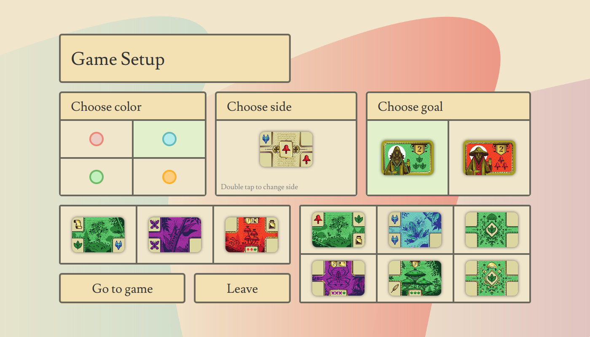

# Codex Naturalis - PoliMi - 2024

By Andrea Galvan, @dstrant, Andrea Grandieri, Enrico Grillo

    

## Grade

30L/30

## About the project

Digital implementation of the board
game <a href="https://www.craniocreations.it/prodotto/codex-naturalis"> Codex Naturalis </a>
by <a href="https://www.craniocreations.it/"> Cranio Creations </a>.  
This project features a single-server architecture that can handle multiple games at the same time.
Each game can contain 2 to 4 players (clients).  
All players can play through a Text-based User Interface (later referred as CLI) or a Graphical User Interface (GUI).  
This project implements several Design Patterns from software engineering principles, and it is in fact based on
the MVC Pattern (Model-View-Controller).  
Information about network messages and communication can be found into project `documentation`.

## Implemented Features

Apart from the basic rules of the game, we implemented a set of further features, including 3 out of 4 advanced
features:

| Feature                         | Implemented |
|:--------------------------------|:-----------:|
| Complete rules                  |     ✔️      |
| TUI                             |     ✔️      |
| GUI                             |     ✔️      |
| Socket                          |     ✔️      |
| RMI                             |     ✔️      |
| Multiple Games                  |     ✔️      |
| Client Disconnection Resilience |     ✔️      |
| Chat                            |     ✔️      |
| Server Persistance              |      ❌      |

## Other Features

* Chat can be used inside the lobby, both before and after the game has started;
* The GUI is responsive and fits both large and small screens with no need for scrolling;
* The GUI features lots of game animations;
* CLI users can play together with GUI users with no effort.

# Documentation

All project documentation can be found under `/deliverables` directory of this repo.

## UML

Under `/deliverables/final/uml` we have the UML Class Diagram of our project and the UML Sequence Diagrams of our
network.  
Class diagram contains all Model classes and relevant parts of the Controller.  
Sequence diagrams describe specific usage situations, like joining a match or drawing a card.

## JavaDoc

Most important classes and methods are documented. JavaDoc can be found under `/images/javadoc`.

## Used Tools

Support tools used during the development of this project:

| Library/Plugin | Description                             |
|:---------------|:----------------------------------------|
| Maven          | Project Managing, Java build automation |
| JavaFX         | Graphic packages to support the GUI     |
| Junit          | Framework for code testing              |

# How to Use

This section contains all instructions about how to run this project.

**From Intellij IDEA (Maven required)**

1. Open Terminal on project directory (`C:\[dir]\[project_folder]\`)
2. Run `mvn clean`
3. Run `mvn package`
4. Go to directory `C:\[dir]\[project_folder]\target`
5. Launch Server: `java -jar PSP5-1.0-server.jar`
6. Launch CLI: `java -jar PSP5-1.0-cli.jar` (takes 2 params: server ip address, server port)
7. Launch GUI: `java -jar PSP5-1.0-gui.jar`

If you change the code, you'll have to repeat all the steps over again.

**From Repo clone**

1. Download Server, CLI and GUI jar files from `/deliverables/final/jar` folder
2. Open Terminal on project directory
3. Launch Server: `java -jar PSP5-1.0-server.jar`
4. Launch CLI: `java -jar PSP5-1.0-cli.jar` (takes 2 params: server ip address, server port)
5. Launch GUI: `java -jar PSP5-1.0-gui.jar`

# Game Screenshots

In this section are shown some screenshots taken when using the GUI version of this application. All phases are shown,
from the startup to the end of the game

## Server Connection

  

The very first screen of the client application, where you choose server and network mode. This screen is also similar
to the one where the user can insert a username.

## Main Screen

  
This is the screen where the user can choose to create a new lobby or join an existing one. A click on the refresh
button will result in an update of the existing lobbies list.

## Lobby

  
When joining a lobby, on the left you can see the usernames of all players in the same lobby, and the buttons to start
the match and leave the lobby; the chat is on the right.

## Game Setup

  
This is the screen where you can set up your match: pick a color, a private goal and choose the side of your starter
card.
To help you choose, at the bottom you can see your hand and the initial deck situation.

## Gaming Screen

  
When it's your turn, the grey spots tell you where you can place your cards. Looking at your hand, the grey cards cannot
be placed due to cost requirements.
On the right, you can see other players' boards. At the bottom left you can see the score board.

## Place animation

# Disclaimer

Codex Naturalis is a board game developed and published by Cranio Creations Srl.
All graphical content of this project that are associated with the official board game have been used
under Cranio Creations Srl. approval and only for educational purposes.
Distribution, copying or reproduction of these contents and images out of this project is forbidden, as well as
publishing these contents for other purposes.
Commercial use of the aforementioned content is as well forbidden.
